# Architecture map

<!-- Generated from `.fallowrc.json` by `pnpm generate:architecture-map`.
     Do not edit by hand: a drift test byte-compares this file against a fresh run. -->

The zone-level dependency graph LGI.tools enforces, derived from the `boundaries`
block of the Fallow configuration. `docs/architecture-boundaries.md` is the prose
owner of the same map; this file is its generated picture, and the public devlog
renders it as a permission matrix.

Zones: 23. Declared permissions: 108 (reference-core exceptions: 1). First-match carve-outs: 1.

```mermaid
flowchart TD
    %% A --> B: A may import B, because the boundary rules declare that permission.
    %% A -.-> B: sanctioned reference-core exception into an auto-discovered band.
    %% A -. .- B: first-match carve-out — files under A classify before B claims them.
    %% Any pair of different zones with no link is forbidden: deny-by-default applies between zones, and imports within a single zone are unconstrained.
    ui["ui"]
    platform__auth["platform/auth"]
    platform__owner_sync["platform/owner-sync"]
    platform__esi["platform/esi"]
    platform__search["platform/search"]
    platform__purge["platform/purge"]
    platform__page_settings["platform/page-settings"]
    composition["composition"]
    components_composition["components-composition"]
    features["features"]
    data["data"]
    lib["lib"]
    components["components"]
    api["api"]
    app["app"]
    scripts["scripts"]
    transport["transport"]
    db["db"]
    config["config"]
    esi_datasets["esi-datasets"]
    convex["convex"]
    runtime["runtime"]
    data__eve_data["data/eve-data"]

    app --> components_composition
    app --> composition
    app --> components
    app --> ui
    app --> features
    app --> platform__auth
    app --> platform__esi
    app --> platform__page_settings
    app --> data
    app --> transport
    app --> lib
    app --> config
    api --> transport
    api --> composition
    api --> features
    api --> platform__auth
    api --> platform__esi
    api --> data
    api --> db
    api --> lib
    api --> config
    scripts --> composition
    scripts --> platform__auth
    scripts --> data
    scripts --> db
    scripts --> lib
    runtime --> transport
    runtime --> features
    runtime --> data
    runtime --> lib
    runtime --> config
    composition --> features
    composition --> platform__auth
    composition --> platform__owner_sync
    composition --> platform__esi
    composition --> platform__search
    composition --> platform__purge
    composition --> platform__page_settings
    composition --> data
    composition --> transport
    composition --> db
    composition --> lib
    composition --> config
    components_composition --> composition
    components_composition --> components
    components_composition --> ui
    components_composition --> features
    components_composition --> platform__auth
    components_composition --> platform__search
    components_composition --> platform__page_settings
    components_composition --> data
    components_composition --> transport
    components_composition --> lib
    components_composition --> config
    features --> platform__auth
    features --> platform__owner_sync
    features --> platform__search
    features --> platform__purge
    features --> platform__page_settings
    features --> data
    features --> transport
    features --> db
    features --> lib
    features --> config
    features --> ui
    features --> components
    components --> ui
    components --> platform__auth
    components --> platform__search
    components --> platform__page_settings
    components --> data
    components --> transport
    components --> lib
    data --> platform__esi
    data --> platform__owner_sync
    data --> platform__search
    data --> platform__purge
    data --> transport
    data --> db
    data --> lib
    data --> config
    platform__auth --> platform__esi
    platform__auth --> platform__purge
    platform__auth --> data
    platform__auth --> transport
    platform__auth --> db
    platform__auth --> lib
    platform__auth --> config
    platform__owner_sync --> platform__esi
    platform__esi --> lib
    platform__esi --> config
    platform__page_settings --> lib
    transport --> lib
    db --> lib
    db --> config
    lib --> config
    convex --> platform__esi
    convex --> platform__auth
    convex --> data
    convex --> lib
    esi_datasets --> composition
    esi_datasets --> db
    esi_datasets --> data
    esi_datasets --> features
    esi_datasets --> platform__auth
    esi_datasets --> platform__purge
    esi_datasets --> lib
    data -.->|reference core| data__eve_data
    api -. first-match carve-out .- app
```

