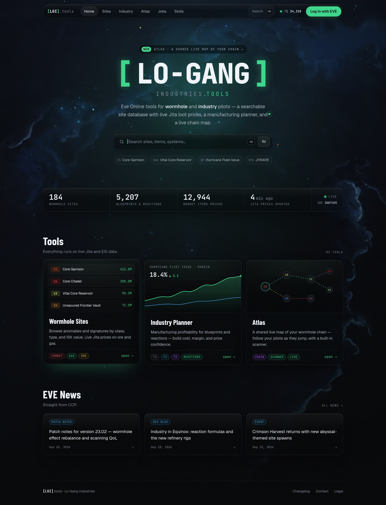
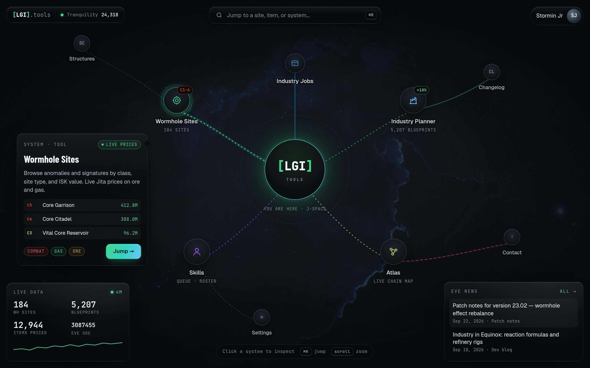
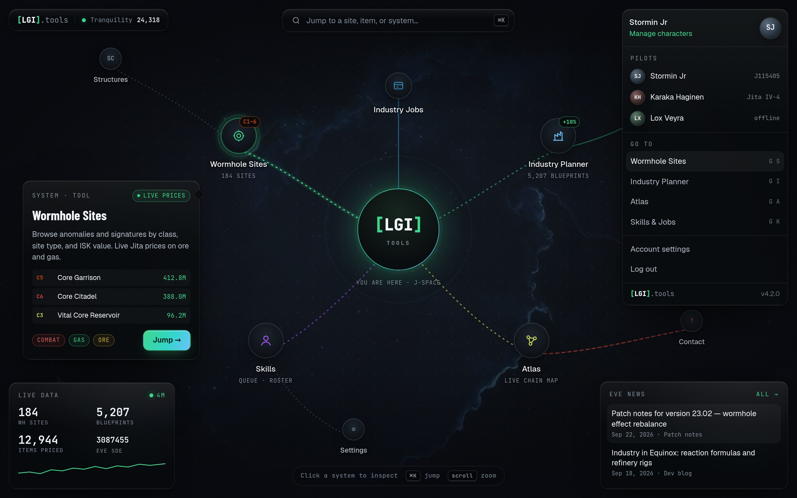
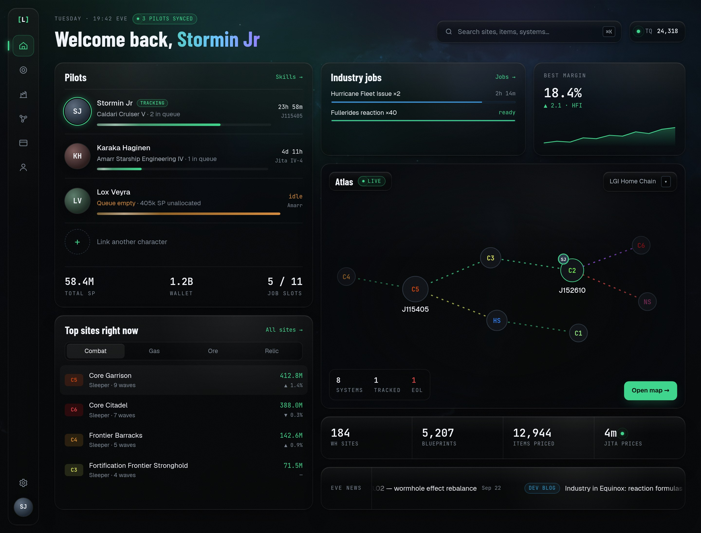
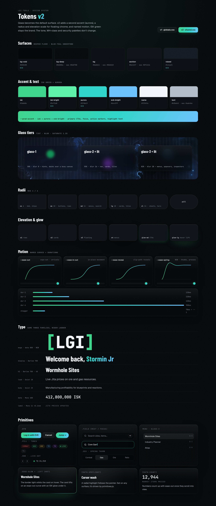

# Homepage redesign — three directions

Static HTML mocks that carry Atlas's visual language (glass map chrome, the
circular-reveal portrait menu, breathing nodes, flowing chain edges) out to
the homepage. All three are built on a proposed **tokens v2** layer
(`shared.css` and `primitives.js`, rendered in `tokens.html`), which evolves
the production tokens in `src/app/globals.css`. Numbers and pilots are
sample data.

Open any `.html` file in a browser to see the motion. Screenshots freeze it.
To re-shoot them, install Chromium with `pnpm exec playwright install chromium`, then run
`node docs/mockups/homepage-redesign/shoot.mjs`.

## A — Orbit (cinematic landing)

- A **floating glass nav pill**, detached from the edges, with a sliding
  active indicator. It holds the ⌘K search, the TQ player count and a solid
  "Log in with EVE" CTA.
- **Hero:** the wordmark sits inside slowly counter-rotating orbit rings, with
  "systems" in WH-class colours riding them. The brackets glow in and out,
  and the nebula drifts (Ken Burns style).
- **Search moves into the hero** as the main call to action, with quick-jump
  chips below it.
- The **live-data ribbon** is one glass strip instead of a 2×2 card.
- **Tool cards get live previews:** ticking site values, a margin chart that
  draws itself in, and a breathing mini-chain. On hover a conic light runs
  around the card edge (shown on the Sites card).

Mobile: [a-orbit-mobile.jpg](screenshots/a-orbit-mobile.jpg)

## B — Chain (the homepage *is* an Atlas canvas)

- A full-bleed map canvas with the dotted grid slowly panning and a fog
  vignette. Each section of the site is a **system** linked to the `[LGI]`
  home node by flowing edges, coloured the way Atlas colours wormhole mass
  and lifetime.
- **Selecting a node** opens a glass inspector with a live preview and a
  "Jump →" CTA.
- The chrome copies `MapChrome`: brand and TQ chip at top left, search pill
  at top centre, and the portrait menu at top right. The menu uses the same
  circular clip-path reveal, extended with a pilot list and keyboard
  go-to shortcuts.
- **Docks:** live data plus a sparkline at bottom left, news at bottom right,
  and a hint bar at bottom centre.
- On mobile the canvas crops to the home node, and a glass bottom sheet
  carries search and the tool list.

Mobile: [b-chain-mobile.jpg](screenshots/b-chain-mobile.jpg)

> Trade-off: this is the boldest option, but the homepage's SEO copy would
> need a server-rendered text fallback (visually hidden, or an
> "About" sheet).

## C — Command Deck (signed-in bento)

- A **floating glass side rail** with a glowing active marker and glass
  tooltips. On mobile it becomes a floating bottom tab bar.
- A **personal greeting** in an animated gradient, over a slow aurora blob
  behind the header.
- **Bento tiles**, each with a cursor-follow spotlight:
  - pilots with shimmering skill bars, and a ring on the pilot being tracked
  - industry jobs on the EVE-blue progress bars
  - the best margin, with a sparkline that draws itself in
  - top sites, with a segmented switcher
  - an embedded Atlas chain preview with glass overlays
  - the stats strip
  - a news marquee
- The guest view would show the same grid with the Pilots tile swapped for
  the sign-in pitch.

Mobile: [c-deck-mobile.jpg](screenshots/c-deck-mobile.jpg)

## Tokens v2

v1 is a flat "inset instrument": 4/6px radii, solid section cards, and ISK
green as the only accent, with glass reserved for small pop-outs. v2 makes
**glass the default surface**. The tone, WH-class and security palettes
don't change.

| Area | v1 (`globals.css`) | v2 (`shared.css`) |
|---|---|---|
| Surfaces | bg-deep / bg / section | Same roles, slightly deeper with a blue-teal undertone, plus `bg-void` and `raised` |
| Borders | Solid hex (`border`, `border-soft`) | White-alpha `hairline` / `hairline-strong` / `hairline-accent`, so borders read on any glass |
| Text | text `#aab4be` | text `#b3bdc8`, one step brighter so it holds up on glass |
| Accent | ISK green only | ISK green + **aurora** `#2fd6c9`, with `--grad-accent` (green → cyan → EVE blue) for primary CTAs, focus, active markers and highlight text |
| Glass | One `glass-panel` (65%, blur 12) | Three tiers: `glass-1` (30%, blur 8), `glass-2` (55%, blur 16) and `glass-3` (82%, blur 28). `.lit` adds a top-edge light and sheen |
| Radii | ctl 4 / card 6 | `xs 6 · sm 10 · md 14 · lg 18 · xl 24 · pill` |
| Elevation | dd, card-edge, card-hover | `e1–e4` ambient/key shadows, `edge-lit`, and `glow-sm/md/lg` as a separate accent layer |
| Motion | fast 150 / panel 200, one `ease-panel` | `dur-1…4` (120/220/420/900), `ease-out` (expo), `ease-in-out`, `ease-reveal`, **`ease-spring`** (CSS `linear()`), and `stagger` |
| Type | Same three families | Adds `text-mega` for the hero wordmark and a larger `h2`. Labels track wider |

### Primitives

| Primitive | What it does |
|---|---|
| `.glass-1/2/3` + `.lit` | Surface tiers. Pick by density of what's behind: canvas hints use 1, cards and nav use 2, menus and popovers use 3 |
| `.btn` `.btn-primary` `.btn-ghost` `.btn-pill` | The primary button is filled with the gradient. Presses scale on the spring curve |
| `.edge-glow` | A conic light orbits the border on hover (or with `.is-hot`), animated through `@property --edge-a` |
| `.lift` | The standard hover: a 4px lift on expo-out with an ISK glow underneath |
| `[data-spotlight]` | A radial wash follows the cursor; the position is fed by `primitives.js` |
| `[data-count]` | Numbers roll up once they scroll into view |
| `.reveal` + `--i` | Staggered entrance (fade, lift, blur-to-sharp), `--i × --stagger` |
| `.seg` | Segmented control whose thumb springs between options (`--seg-i`, `--seg-n`) |
| `.grad-text` | Gradient text that slowly pans |
| `.live-dot` | The status dot plus a radar ping |
| `.kbd` | A keycap with a thicker bottom edge |
| `.flow-edge` `.breathe` `.draw` | Motifs lifted from Atlas: moving dashed edges, breathing nodes, lines that draw themselves in |

All motion sits behind `prefers-reduced-motion`. `@supports` falls back to
solid surfaces where `backdrop-filter` is unavailable.

### Porting to the app

- Put the v2 values in `@theme` in `globals.css`. `--radius-*`, `--shadow-*`
  and `--ease-*` generate Tailwind utilities (`rounded-lg`, `shadow-e3`,
  `ease-spring`).
- Register the new radius and shadow names in `cn.ts` so tailwind-merge
  keeps them.
- Replace `glass-panel` with three `@utility` tiers plus `lit`.
- Make `Card` default to `glass-2 lit`, with `hover` meaning `lift`
  (optionally `edge-glow`).
- `Button` gets a gradient `primary` variant.
- Retire `hover-bob`. `lift` replaces it.
- Wire spotlight and count-up as small client hooks. The count-up hook
  should respect reduced motion, which the mock already does.
